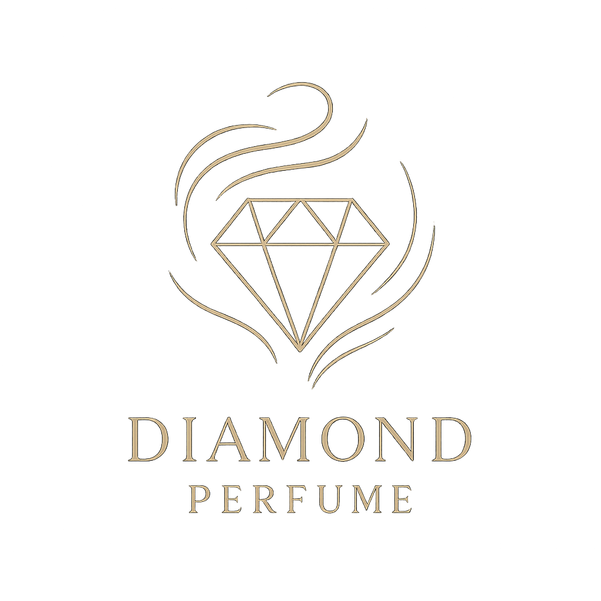

# Diamond Perfume — عطور الماس 💎

موقع إلكتروني فاخر لمتجر عطور في فردان، بيروت — عربي/إنجليزي، سلة تسوّق، وطلب عبر واتساب.

**مبني بالكامل بلغات HTML + CSS + JS فقط** — بدون React ولا أي أدوات بناء (build tools). افتح `index.html` مباشرة أو استضِعه على أي استضافة ثابتة.

## التشغيل

لا حاجة لأي تثبيت. فقط استضِف المجلد:

```bash
# من المجلد:
python3 -m http.server 8080
# ثم افتح http://localhost:8080
```

أو ارفع الملفات كما هي إلى Netlify / Vercel / GitHub Pages — بدون أي خطوة بناء.

## بنية الملفات

```
index.html      ← صفحة الموقع الكاملة
css/styles.css  ← التصميم (أسود × ذهبي)
js/config.js    ← بيانات المتجر (هاتف، واتساب، عنوان، سعر صرف…)
js/data.js      ← المنتجات والتصنيفات
js/i18n.js      ← الترجمات (عربي/إنجليزي)
js/app.js       ← المنطق: السلة، الطلب عبر واتساب، البحث، الفلاتر…
assets/         ← الصور، الخطوط، الشعار
```

## تعديل بيانات المتجر (ملف واحد فقط)

كل شيء يتغيّر من **`js/config.js`**:

| البيان | المكان |
|---|---|
| رقم الهاتف والواتساب | `phoneDisplay` / `whatsappNumber` |
| رابط خرائط غوغل | `mapsShareUrl` |
| سعر صرف الدولار بالليرة | `usdToLbp` |
| روابط السوشال ميديا | `social` |
| أوقات الدوام والعنوان | `hours` / `address` |

## تعديل المنتجات

من **`js/data.js`** — انسخ أي منتج وعدّل: الاسم (عربي/إنجليزي)، السعر `price`، السعر قبل الخصم `oldPrice` (اتركه `null` بدون خصم)، التصنيف `cat` (`women` / `men` / `oriental` / `niche`)، الصورة `image`.

صور المنتجات توضع في **`assets/images/`**.

## استبدال الشعار

الشعار الحالي رسم SVG في `index.html` (بحث عن `brand-logo`). لوضع شعارك: ضع ملفك في `assets/images/logo.png` واستبدل كتلة `<svg class="brand-logo">…</svg>` بـ:

```html

```

## الخط العربي

«خط ثمانية» الرسمي (مجاني للاستخدام التجاري — font.thmanyah.com) بخمسة أوزان، مضمّن محلياً في `assets/fonts/`.
